# DolphinDB VSCode Extension for SQLTools 

This package is part of [vscode-sqltools](https://vscode-sqltools.mteixeira.dev/en/home) extension.

> Note: The current extension has been validated and tested with SQLTools v0.28.4. 

## Getting Started

### Click the SQLTools Database Icon
Click the **SQLTools database** icon to navigate to the connection configuration interface.

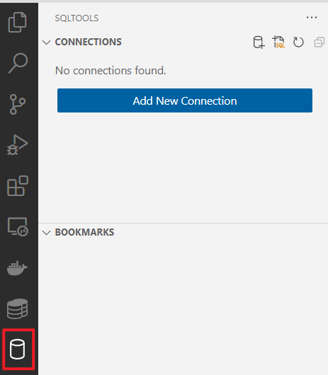

### Select DolphinDB in the Driver Field
In the **Select your database driver** field, select **DolphinDB**.

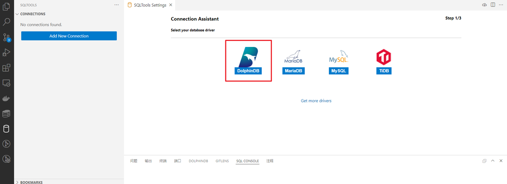

### Configure Connection Information
Fill in the connection details. Fields marked with an asterisk (*) are required. 

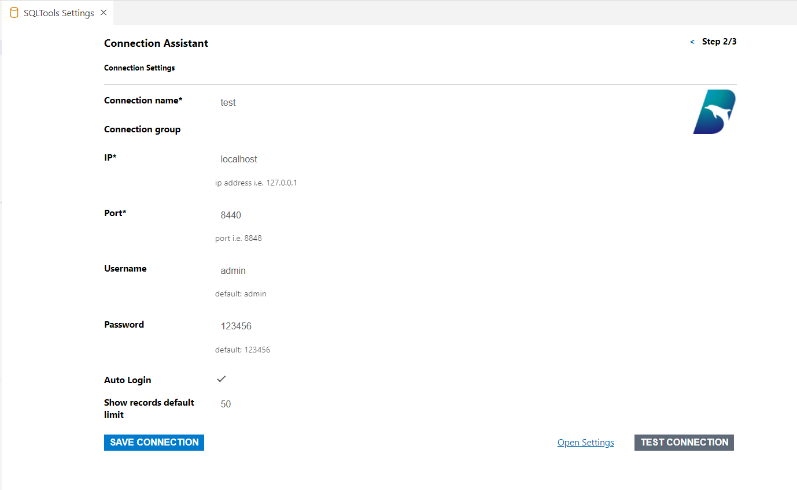

The configurations are as follows:

- **Connection Name***: A unique identifier for the connection. It is recommended to use the node alias, such as `local8848` or `dnode1`.
- **IP***: The IP address of the target node, for example: `localhost`.
- **Port***: The port number used by the node, for example: `8848`.
- **Username**: The username for authentication. Defaults to `admin`.
- **Password**: The password for authentication. The default password is `123456`. You can modify it later using the `changePwd` function.
- **Auto Login**: Whether to enable automatic login. Defaults to `false`. If a username and password are provided, you may choose to enable this option for automatic authentication on startup.
- **Show Records Default Limit**: The default number of records displayed per page in query results.

### Test and Save the Connection

After configuring the connection, click the **TEST CONNECTION** button to verify if the connection is successful.

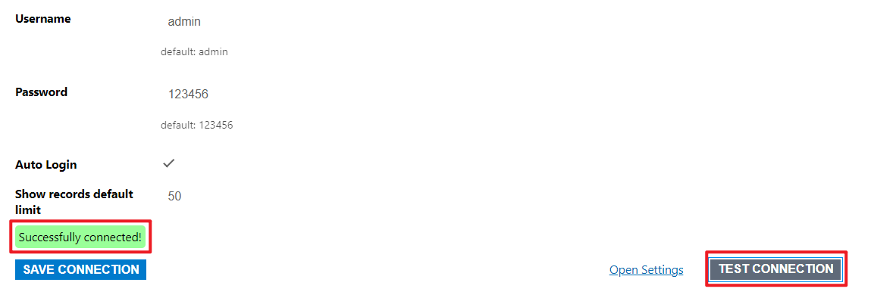

If the test is successful, click **SAVE CONNECTION** to save the connection information.

### Connect and Start Scripting

After saving, the system will display basic connection information. Confirm that the details are correct.

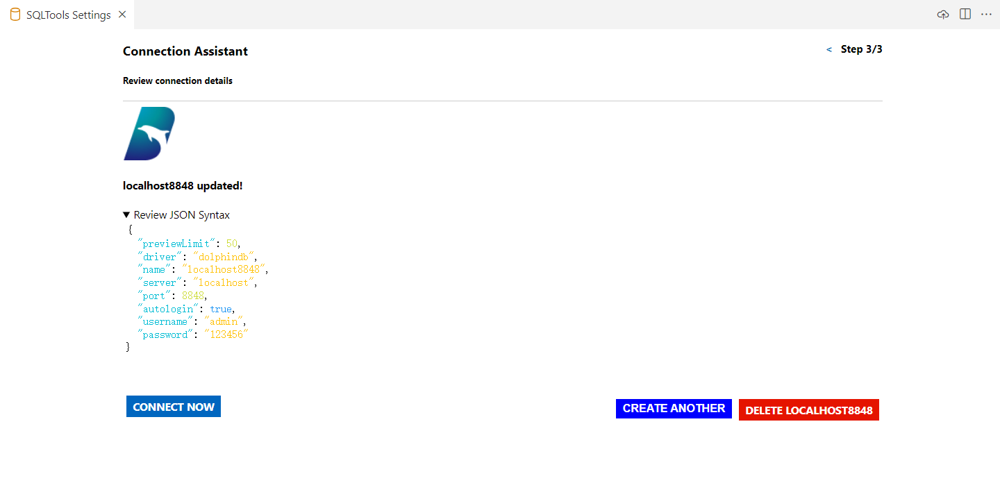

Click **CONNECT NOW** to establish the connection and create a new SQL file for writing scripts.

## UI Interface Description

### SQL Tools Section

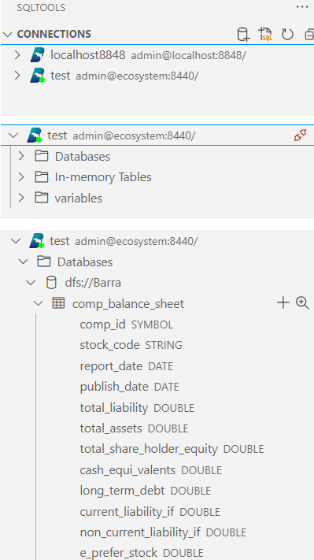

The SQL Tools section displays different connection information. Each connection includes three subdirectories:

* **Databases**: Contains distributed database and table information. Information includes: database name, table name, column name, and column type.

* **In-memory Tables**: Contains in-memory table information. Information includes: table name, column name, and column type.

* **Variables**: Contains information about other variables. Information includes: variable name and variable type (e.g., matrix, scalar, set, etc.).

### Operations

For table-type objects, click the **magnifying glass** button on the right to view table data.

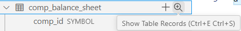

Click the **+** button to generate an `insert` statement.

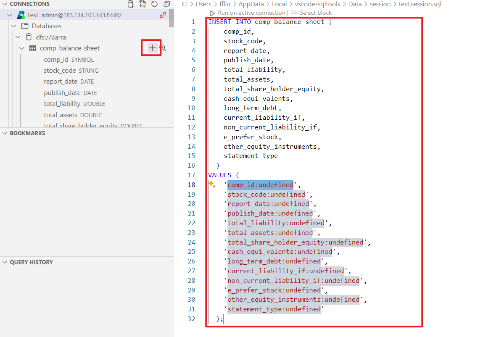

In the script execution section, users can write scripts and then click **Run on active connection** to execute the script.

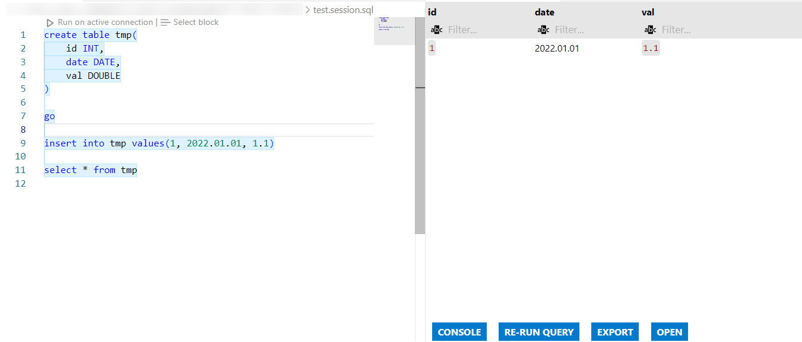

The results section on the right will display:

* The script execution results.
* Table records queried using the **Show Table Records** command.
* Table schema using the **Describe Tabe** command.

> **Note**: When executing a script with multiple statements in DolphinDB, only the result of the last statement is returned.

* Function Buttons:

    * **CONSOLE**: SQL terminal, outputs execution information. Typically, execution information includes details such as the dimensions, type, and data format of the returned object.
        
        

    * **RE-RUN QUERY**: Re-executes the statement.
    * **EXPORT**: Exports execution results as a CSV or JSON file.

        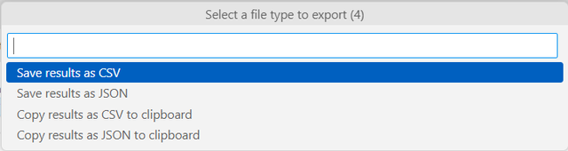

    * **OPEN**: Views execution results as a CSV or JSON file.

        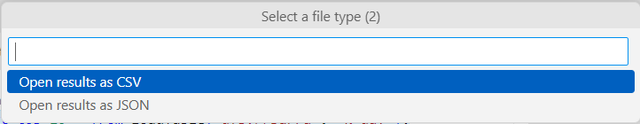

### Query History Section

The **QUERY HISTORY** on the left saves the query history records, allowing users to review or re-execute previous queries.